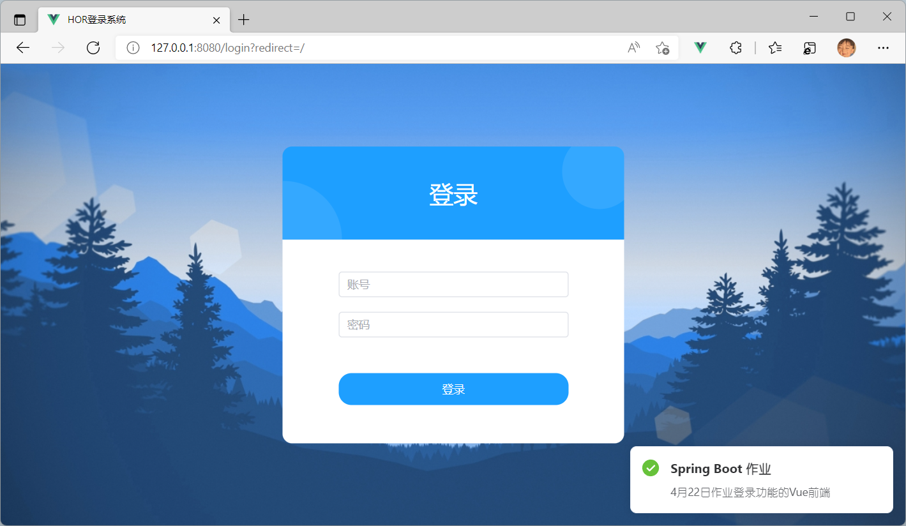
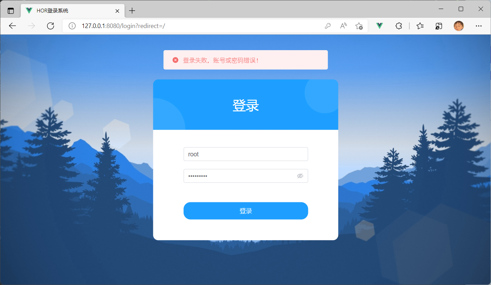

# Spring Boot 4月22日作业

## 开发环境
- **JDK 1.8 +**
- **Maven 3.8 +**
- **IntelliJ IDEA 2021.3 +**
- **Mysql 5.7 +**

## 任务需求
> 使用SpringBoot 的Web模块完成一个登录功能
- [x]  （1）要有登录页面，登陆页面包含账号、密码输入框，还有提交按钮；
- [x]  （2）当输入的密码正确时，则给浏览器响应：
- [x]  （3）当输入的密码错误时，则给浏览器响应：
>其他部分可自由发挥，比如页面可以更美观，可以连接数据库等。
## 优化：
- [x] 使用 VUE3 构建前端页面
- [x] sa-token 实现登录认证账户鉴权

## 数据库文件
[login.sql](https://gitee.com/Hors/login-demo/blob/master/static-files/login.sql)
## 效果展示

## 未完...